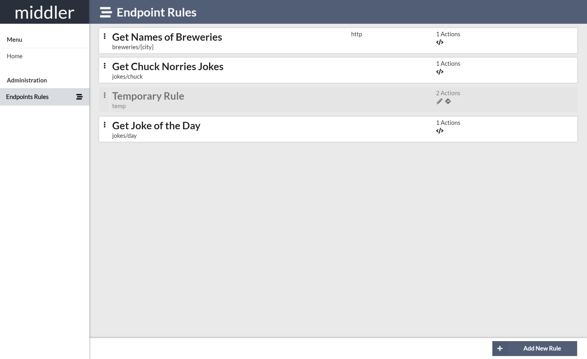
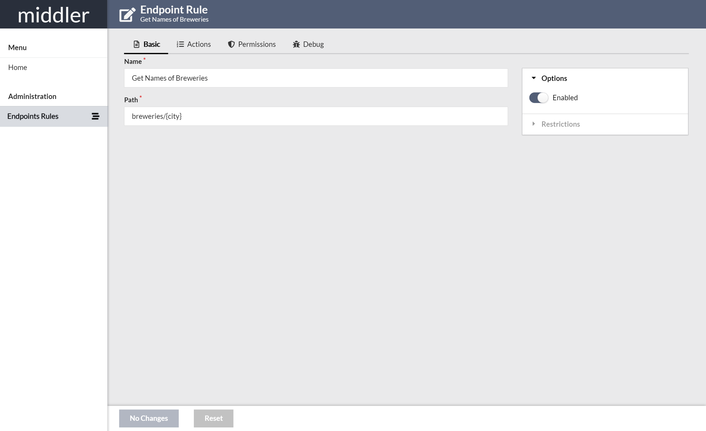
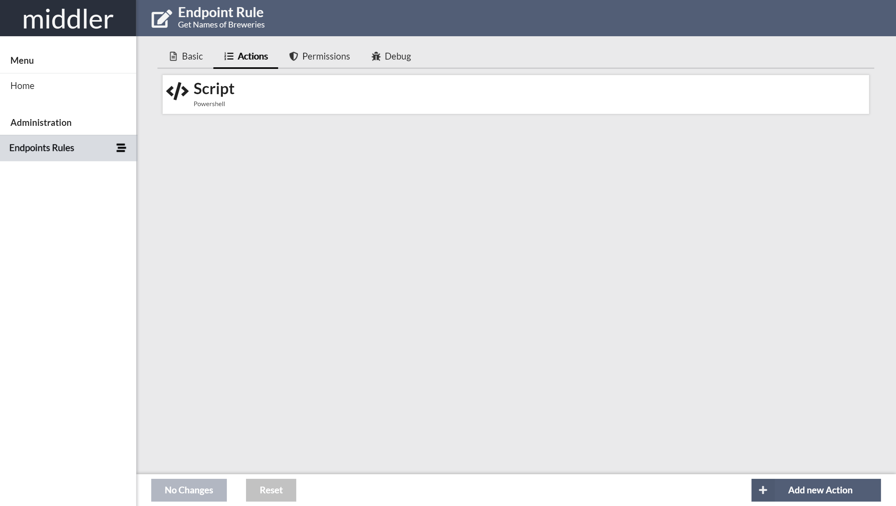
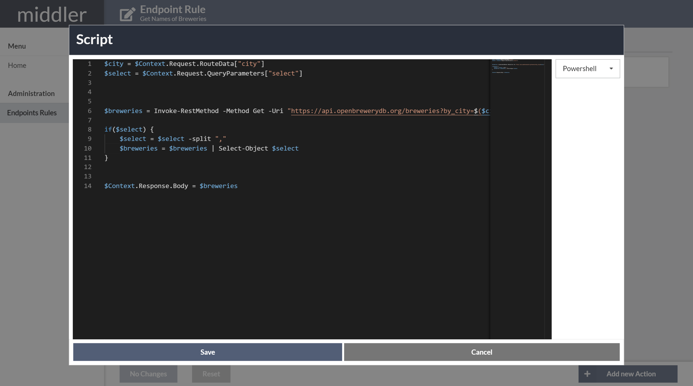

# middler

`middler` aims to be kind of a Reverse Proxy or API Gateway  
You define `Rule's` which, based on matching criterias, can be invoked, ignored or denied.  
Creating, updating or removing of `Rules` can easily be done on the UI at runtime.

# Rule
A `Rule` is defined by:  
* HTTP Scheme(s)
* Hostname(s)
* Path
* HTTP Method(s)
* none or multiple `Permission Rules`
* none or multiple `Actions`

If all criterias for a `Rule` matches with the HTTP Request, the Actions for this Rule will be invoked in order.

  

# Action
Currently following Actions are implemented:
* UrlRedirect
* UrlRewrite
* Scripting
    * Javascript
    * Typescript
    * Powershell
* Proxy/Forward Request (in Progress)

Detailed Information for each Action will be available in WIKI at some Time...

## Example of a Powershell Script Action

